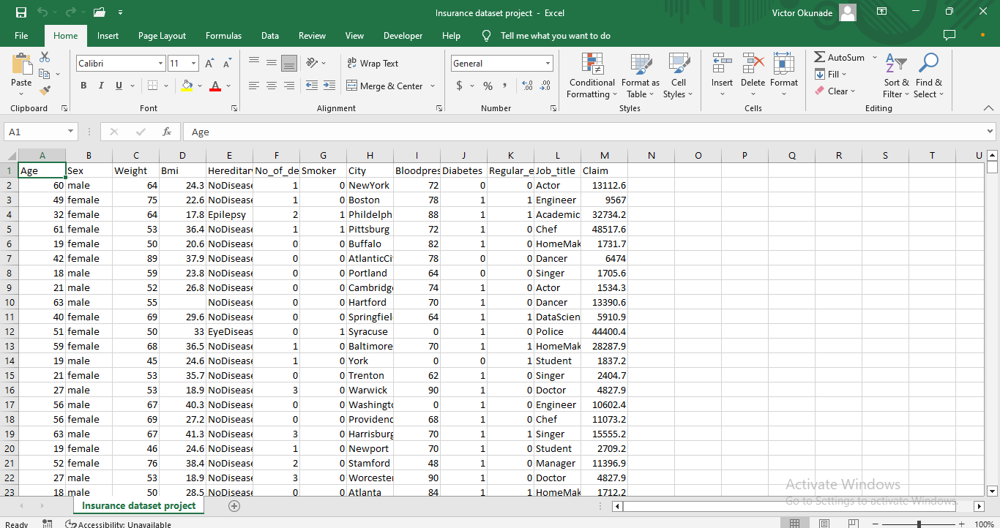
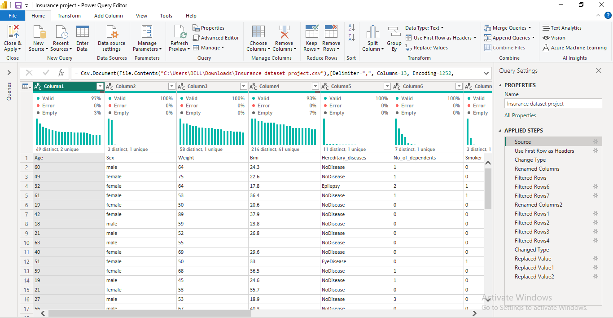
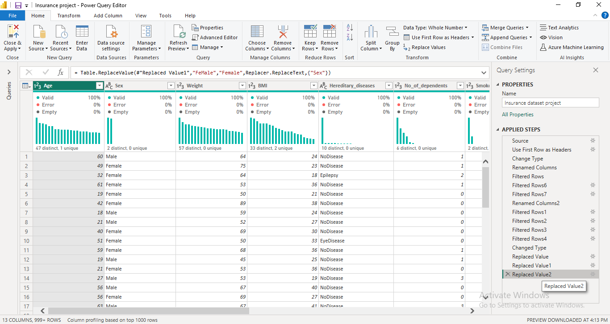
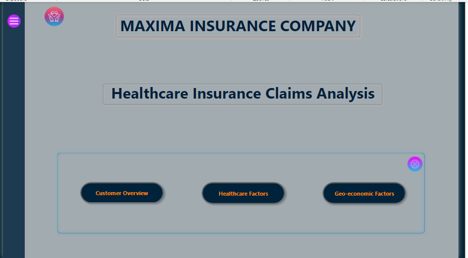
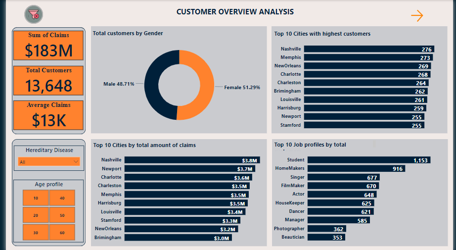
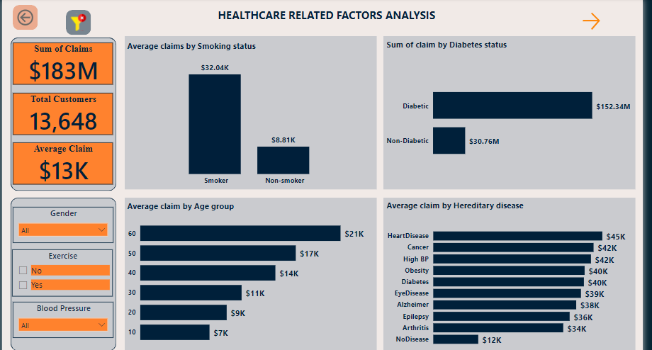
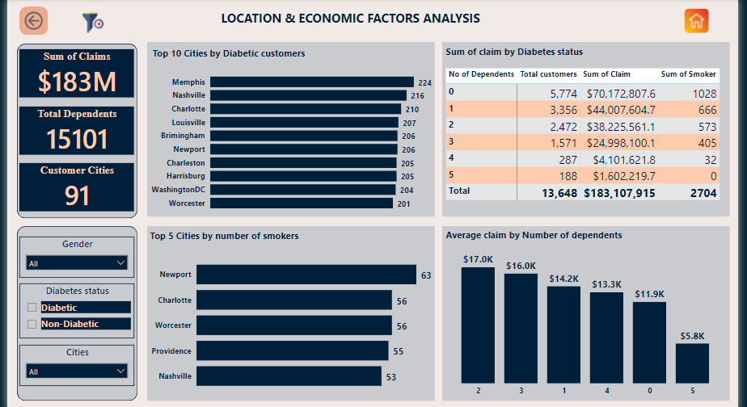

# Maxima_Insurance_Healthcare_claims_Analysis

## Introduction
This power BI project is an exploratory analysis of the insurance healthcare claims of **Maxima Insurance**
The main goal of this project is to generate insights into the factors that affect the healthcare claims within the comapany. The exploratory analysis involved analyzing customer data and visualizing the data to help drive business decisions with user friendly navigations.

_Disclaimer: Maxima is an imaginary name_

## Problem statement
Analysis is intended to find insights into the leading factors for increased healthcare claims amidst Maxima healthcare insurance customers

## Source of data
Dataset was provided by the Solent University in United Kingdom,Department of Data science in a spreadsheet format

## Data Transformation

Initially, mild data cleaning was done on Microsoft excel to convert the data from a text format to spreadsheet format using delimiters as separators. The transfomations can be seen in the images below:

Text format   |   CSV format
:------------:|:--------------:
         |         

Deeper cleaning was done using power query after dataset was imported into Power BI. Few transformations done include:
- Changing of data types in some columns to the appropriate format
- Renaming columns and replacing values
- Creation of new columns using DAX conditional command to group data in categories

The BI transformations are shown in the following images:

Before cleaning     |     After Cleaning
:------------------:|:-----------------------:
               |               

## Data Modelling
No modelling was carried out because the dataset was in a single table

## Analysis and Visualization

The report comprises 4 pages:
- Home Page
- Customer Overview
- Healthcare factors 
- Geo-economics

**You can interact with the report [here](https://app.powerbi.com/view?r=eyJrIjoiNmNlYmFkY2ItMDZkMi00YTI3LThjZGItNjJmNWMzMTJiY2JiIiwidCI6ImQxYzA5Yzk2LTk2MDctNGM1OS1iZDIyLWM5ZjUwMWIxOTFkZCJ9)**

The **Home Page** contains different features to enhance ease in navigation for the user. The home page contains:
- The Hamburger button which opens up the page navigation for visibility
- The Cancel 'X' to close the page navigation bar
- The page navigation which hosts the buttons to the other three pages
- All the buttons also have hovering effects to show their activeness

### Customer overview page

The following insights can be gained from the customer overview page:
- Maxima insurance have 13,648 customers on their healthcare claims subscription. 
- The gender distribution of their customers is almost even with the females outnumbering the males by few numbers 
- Sum of total claim being 183 million dollars at an average of 13 thousand dollars per customer
- Nashville is the city with the highest sum of claims which is backed up by being the city with the most of Maxima customers
- Students are also the highest subscribers to Maxima healthcare insurance 

### Going to the next page which shows analysis of healthcare dependent indexes that variably affect claims, the following insights were deduced:

- Average claim is higher in customers who are smokers comapared to those who are non-smokers. There is also a wide margin of difference between their averages
- Diabetic patients who by number are major part of Maxima subscribers have higher sum of claims than the non-diabetic patients
- Customers in the age group 60+ have the highest average claims value
- Customers suffering from hereditary heart diseases have the highest health claims on average compared to other hereditary disease

### The last page contains information about the location of customers and other economic variables like number of dependents which is a factor considered in determining amount of claims a customer is entitled to

The insights gained from here include:
- Maxima customers are spread across 91 cities with a total number of dependents being 15,101
- Number of customers having diabetes are resident mostly in Memphis
- Number of customers that smokes are resident mostly in Newport
- Customers with 3 dependents have the highest average claims compared to those with 5 dependents that have the lowest average claims
- This page also contains a table which highlights the number of dependents in relation to the total customers and customers that smoke

## Conclusion and Recommendation

Analysis shows smoking, diabetes and hereditary diseases particularly,heart diseases are the highest contributing factors to maxima health insurance claim expenses. Maxima can partner with their customers healthcare providers in order to better manage their conditions.

- Smoking and heart disease which are larger contributors to the amount of healthcare claims the company is funding are both linked to behavioral deficiencies on the part of the customers. Smoking has been proven to be a leading factor contributing to occurrence of heart diseases. 

- Analysis also shows that majority of the customers do not exercise which can be another potential contributory factor to the incidence of heart disease and obesity.

- I would recommend that Maxima becomes actively involved in the healthcare and lifestyle management of their consumers as the major factors driving up healthcare claims are dependent on the consumer’s behavior. Improving on these factors would see the company’s expenses in terms of healthcare claims reduce drastically which isn’t only beneficial to the company alone but also to their customers.

- Students make up the majority of subscribers to the Maxima healthcare insurance. This might be due to the low cost of subscription. They can leverage on this profile of customers for their marketing and advertising campaigns to increase their customers thus improving their coverage

